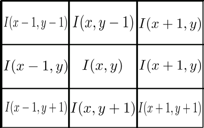

# Detecção de Bordas
A visão computacional é composta por um conjunto de métodos tendo com objetivo extrair informações de dados multimencionais. Quase sempre esses métodos recorrem a uma analogia de como nós detectamos e reconhecemos objtos. Um objeto é caracterizado por um conjunto de atributos, como cor, texturas e forma geométrica. O contorno é um do atribuitos que pode ser usado para esse fim. Por exemplo podemos identificar diversas formas geométricas como retangulo circulo, triangulos, linhas e outros.

Nessa capítulo vamos conhecer alguns algoritmos para deteção de borda e implementa-los.
### O que é uma borda?

Em uma imagem uma borda á caracteriza por uma variação abrupta entre os piexels vizinhos.

<div align="center">
    <p align="center">
    
    </p> <p align="center"> <b>Figura 1:</b>  Pista de corrida </p>
</div>

Primeiro vamos pensar apenas na linha selecionada imagem, podem representa-la por uma função i(x) cujo dominio é uma lista [254,254,173,138,79,44,45,53]

como nossa função é dicreta (só admite valor inteiro) não podemos calcular diretamente a derivada dessa função mais podemos fazer uma boa aproximação.

A derivada de uma função é dada por.
<div align="center">
         <p align="center">
         
         </p>  <p align="center"> <b>Equção 1: </b> Derivada. </p>
 </div>
Podemos fazer uma aproximação para um calculo pontual.

<div align="center">
    <p align="center">
    
    </p> <p align="center"> <b>Figura 2: Derivada aproximada </b> . </p>
</div>

<div align="center">
         <p align="center">
         
         </p> <p align="center"> <b>Equção 2: </b> Derivada aproximada. </p>
 </div>
 Essa equação pode ser descrita por um kernel. A convolução desse kernel nos da o mesmo resultado da equação.
 
 <div align="center">
    <p align="center">
    
    </p> <p align="center"> <b>Figura 3: </b> Kernel para calculo de derivada. </p>
</div>

Na Figua 2 calculamos isso para a linha da imagem, tente identificar onde está a regição que selecionamos.

<div align="center">
    <p align="center">
    
    </p> <p align="center"> <b>Figura 4: </b> Grafico de linha da selecionada na figura 1. </p>
</div>

Se expandirmos esse ideia para o plano 2D nossa função anterir pode ser decrita da seguinte forma.


<div align="center">
    <p align="center">
    
    </p> <p align="center"> <b>Figura 5: </b> Aproximação de derivada. </p>
</div>

Agora temos dois eixos, portanto calculamos a derivada parcial. Da mesma forma podemos rescrever isso com um kernel

<div align="center">
    <p align="center">
    
    </p> <p align="center"> <b>Figura 6: </b> Kernel para derivada parcial. </p>
</div>

Esse par de kernel na Figura 6 tem o nome de operador Sobel. O OpenCV tem esse operador implementado aqui 

```python
import cv2
ddepth = cv2.CV_16S
# Carrega imagen "frame.png" em escala de cinza
gray = cv2.imread("frame.png",cv2.IMREAD_GRAYSCALE)
# calcula derivada de primeira ordem na direção x 
grad_x = cv2.Sobel(gray, ddepth, 1, 0, ksize=3)
# calcula derivada de primieira ordem na direção y
grad_y = cv2.Sobel(gray, ddepth, 0, 1, ksize=3)

# calcula valor absoluto e converte para uint8 
abs_grad_x = cv2.convertScaleAbs(grad_x)
abs_grad_y = cv2.convertScaleAbs(grad_y)

# Calcula gradiente
grad = cv2.addWeighted(abs_grad_x, 0.5, abs_grad_y, 0.5, 0)
# concatena image gerada com a original
saida=cv2.hconcat((grad,gray))
# redimenciona em 60%
saida=cv2.resize(saida,None,None,0.4,0.4)
#salva imagem
cv2.imwrite("saida.png",saida)
cv2.imshow("janela", saida)
cv2.waitKey(0)
```

<div align="center">
    <p align="center">
    
    </p> <p align="center"> <b>Figura 7: </b> Resultado do Sobel. </p>
</div>

Percebe que aplicamo o operador Sobel duas vezes, primeiro na direção x e depois na direção y. A composição dessas derivada é matematicamente conhecida com gradiente. O gradiente é um vetor que aponta na direção onde a função tem a maoir variação. No entanto, o que nos interessa aqui é magnitude desse gradiente, ou seja o quão abrupta é aquela variação. Essa operação é decrita pela Equação 2 e usarmo a função cv2.addWeighted para calcular.

<div align="center">
         <p align="center">
         
         </p> <p align="center"> <b>Eqiação 3: </b> Magnitude do gradiente. </p>
 </div>

nos usamos uma imagem em escala de cinza para facilitar a copreenção, mas 
isso pode ser aplicado em uma imagem de cor. Em imagem de cor o calculo tem como base a distância elclidiana dos
pixels.


# Algoritmo de Canny

O algortimo de Canny executa varios estágio para detectar uma contorno.

#### 1. remoção de ruídos.

Na figura 4, o grafico da derivada apresenta bastante ruido, isso acontece porque pegamos micros variações locais. Canny usa um filtro gaussiano para resolver isso. Seja como o filtro afeta a derivada no Figura 8.

<div align="center">
    <p align="center">
    
    </p> <p align="center"> <b>Figura 8: </b> Efeito de filtro gaussiano.</p>
</div>  

#### 2. Calcular gradientes.
O filtro Sobel discutido no tópico anterir é usado aqui para calcular o gradientes.

#### 3. Máximos locais.
Nessa etapa uma varredura completa é realizada na imagem em busca de gradientes máximo locais, esse processo elemina bordas largas ou duplicadas.

#### 4 Limiar de hesterese.

Tudo que esta abaixo de minVal é descartado. o que esta entre minVal e maxVal é mantido apenas se parte do contorno estiver acima de maxVal. Na Figura 9, A é mantido porque esta acima de maxval, C é mantido, embora esteja abaixo de maxVal ele esta conectado a A. Já o B é removido, pois esta totalmente dentro da área delimintada.

<div align="center">
    <p align="center">
    
    </p> <p align="center"> <b>Figura 9: </b>Região delimitada pelos liminar maxVal e minVal. <h5>Fonte: <url>https://docs.opencv.org/master/da/d22/tutorial_py_canny.html</url></h5>.</p>
</div>  

### Usando Canny
No OpenCV temos uma implementação do algoritmo de Canny, o segundo e o terceiro parâmetro passados são minVal e maxVal.

```python
import cv2
# Carrega imagem em escala de cinza
gray = cv2.imread('frame.png',cv2.IMREAD_GRAYSCALE)
# aplica algoritmo de Canny com minVal=100 e maxVal=200
edges = cv2.Canny(gray,100,200)
# concatena imagem original com o resultado
saida=cv2.hconcat((gray,edges))
#redimenciona 
saida=cv2.resize(saida,None,None,0.4,0.4)
#Mostra saida
cv2.imshow("janela",saida)
cv2.waitKey()
```
<div align="center">
    <p align="center">
    
    </p> <p align="center"> <b>Figura 9: </b> Resultado do Canny. </p>
</div>


<table>
    <tr>
        <td>Documentação oficial opencv v 4.5.0: Algoritmo de Canny. fonte https://docs.opencv.org/master/da/d22/tutorial_py_canny.html</td>
    </tr>
</table>
