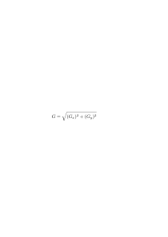

# Detecção de Bordas

sabel

         [-1 0 1]
    dy = [-2 0 2]
         [-1 0 1] 

fdasfd

         [-1 -2 -1]
    dy = [ 0  0  0]
         [ 1  2  1] 
         
         
# Algoritmo de Canny

    

    
    

ds

d
d