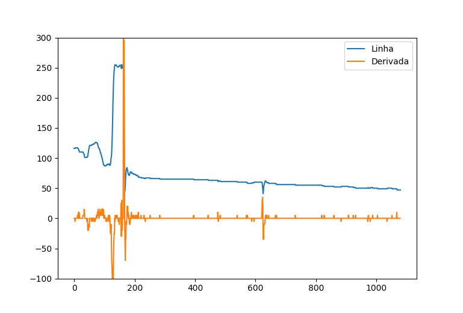
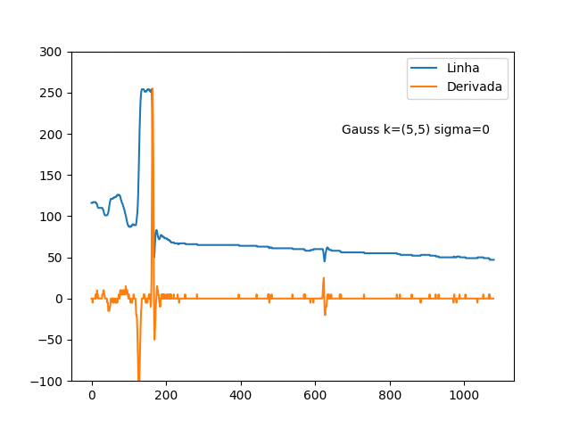

# Detecção de Bordas
A detecção de objeto em imagem é um dos problemas classicos de visão computacional. Muitos métodos já foi desenvolvido para resolver esse problema e eles recorrem a uma analogia de como nós detectamos e reconhecemos objtos. Um objeto é caracterizado por um conjunto de atributos, como cor, texturas e forma geométrica. sendo assim obter os contorno de objeto em imagem pode ser útil para muitas coisa. Por exemplo podemos identificar diversas figuras geométricas como retangulo circulo, triangulos, linhas e outros.

Nessa capítulo vamos discutir como a base de como um algoritmo de deteção de borda funciona e implementar alguns deles para verificar os resultados. 

### O que é uma borda?

Em uma imagem uma borda á caracteriza por uma variação abrupta entre os piexels vizinhos.

    

    
    
 
 <b>Figura 1:</b>  Pista de corrida 

Primeiro vamos pensar apenas na linha selecionada imagens, podem representa-la por uma função i(x) cujo dominio é uma lista [254,254,173,138,79,44,45,53]

como nossa função é dicreta (só admite valor inteiro) não podemos calcular diretamente a derivada dessa função mais podemo obter uma boa aproximação.

A derivada de uma função é dada por.

         

         
         

 

Assim podemos fazer uma aproximação e quanto mede uma vairação pontual.

    

    
    
 
 <b>Figura 1: </b> Grafico de linha da selecionada na figura 1. 

         

         
         

 

 Essa equação pode ser descrita por kernel.
 
 

    

    
    
 
 <b>Figura 1: </b> Grafico de linha da selecionada na figura 1. 

Na Figua 2 calculamos isso para a linha da imagem, tente identificar onde está a regição que selecionamos.

    

    
    
 
 <b>Figura 2: </b> Grafico de linha da selecionada na figura 1. 

se expandirmos esse ideia para o nosso plano da imagem 2D nossa função anterir pode ser decrita da seguinte forma.

    

    
    
 
 <b>Figura 2: </b> Aproximação de derivada. 

Da mesma forma podemos rescrever isso com um kernel

    

    
    
 
 <b>Figura 2: </b> Kernel para derivada na direção. 

Encontrar contornos em imagem se resume em obter os gradiente de maior intensidade.

### Sobel
esse par de janelas tem o nome de operador sobel
O Sobel é algotritmo que calcula os gradiente aproximado de uma imagem. Porem o sobel usa um grupo de pixeis a

         [-1 -2  1]
    dx = [0   0  0]
         [-1  2  1] 

fdasfd

         [-1 -2 -1]
    dy = [ 0  0  0]
         [ 1  2  1] 

         

         
         

 

Nós vamos usar uma imagem em escala de cinza para facilitar a copreenção, mas 
isso pode ser aplicado em uma imagem de cor. Em imagem de cor o calculo tem como base a distância elclidiana dos
pixels.

mostrar como o sobel melhora com bur

# Algoritmo de Canny

O algortimo de Canny executa varios passo para detectar uma contorno

> Na imamge xxx, a calculo de derivada apresenta bastante ruido, isso acontece porque pegamos micros variações locais, Canny propos o uso de uma filtro gaussiano para resolver isso. Nesse caso vamos precisar ajustar o filtro para ter um bom resultado. Seja como o filtro aféta nos derivada no Figura

    

    
    
 
 <b>Figura xx: </b> Efeito de filtro gaussiano.

  

> Depois de filtrado, os modulo dos gradiente são calculado usando Sobel.

